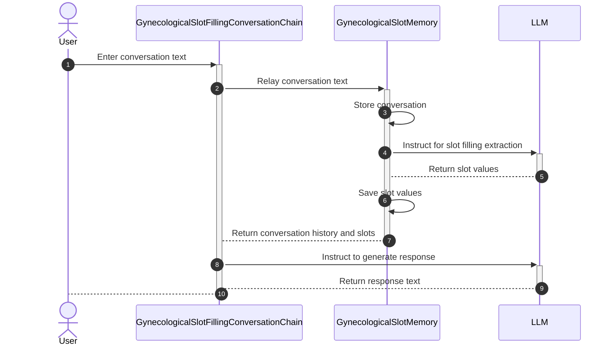

## Slot filling example
Slot filling is a natural language processing task that involves extracting necessary information from a dialogue with a user. For example, in a gynecological chat system, the system may need to gather information such as symptoms, duration, and past medical history to help healthcare professionals prepare for the appointment.

In this repository, we implement slot filling using LangChain.

## Sequence diagram


## Setup
```
pyenv install 3.11.3
pyenv local 3.11.3
poetry env use python
poetry shell
poetry install
```

## Usage
```
# Retrieve your API key from https://platform.openai.com/account/api-keys
export OPENAI_API_KEY=${YOUR_API_KEY}
PYTHONPATH=./ python chat.py
```

## Run logs
Example 1
```
You: Hello, I've been having abdominal pain for the past few days.
AI: I'm sorry to hear that. Can you describe the pain in more detail, and are you experiencing any other symptoms?
【Slot】: {'symptoms': 'abdominal pain', 'duration': 'a few days', 'past_medical_history': 'null'}
You: It's a sharp pain, occasionally occurring, and I've also had some bloating.
AI: Have there been any changes in your diet or stress factors that could be related to these symptoms?
【Slot】: {'symptoms': 'sharp abdominal pain, bloating', 'duration': 'a few days', 'past_medical_history': 'null'}
You: Not really, but I am quite stressed lately at work.
AI: Stress can definitely have an impact. Have you experienced anything similar before, or do you have any known gynecological issues?
【Slot】: {'symptoms': 'sharp abdominal pain, bloating', 'duration': 'a few days', 'past_medical_history': 'null'}
You: I haven't experienced this before, and I don't have any known issues.
AI: Finish[yes]
【Slot】: {'symptoms': 'sharp abdominal pain, bloating', 'duration': 'a few days', 'past_medical_history': 'no known gynecological issues'}
```

Example 2
```
You: I've been getting lower back pain and it's been making it difficult to work.
AI: That sounds quite uncomfortable. How long have you been experiencing this pain?
【Slot】: {'symptoms': 'lower back pain', 'duration': 'null', 'past_medical_history': 'null'}
You: It started about a week ago.
AI: Is the pain constant or does it come and go? Also, have you had any past medical history that might be relevant?
【Slot】: {'symptoms': 'lower back pain', 'duration': 'about a week', 'past_medical_history': 'null'}
You: It's intermittent and I had surgery last year but not for anything related to this.
AI: Thank you for the details. Given your symptoms and history, it would be best to see a medical professional for a thorough evaluation.
【Slot】: {'symptoms': 'lower back pain', 'duration': 'about a week', 'past_medical_history': 'previous surgery, unrelated to current issue'}
You: Okay, I will book an appointment. Thank you.
AI: Finish[yes]
【Slot】: {'symptoms': 'lower back pain', 'duration': 'about a week', 'past_medical_history': 'previous surgery, unrelated to current issue'}
```